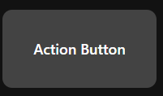
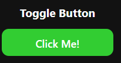
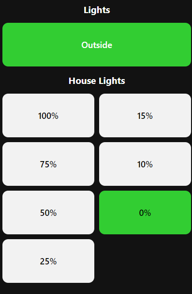

# NodeRed Dashbored
A more customizable dashboard for NodeRed, not to be confused with the [NodeRed Dashboard](https://github.com/node-red/node-red-dashboard) project.

# Features
* Widgets!
* Configuration within the NodeRed flow(s)
* Custom CSS
* Compatibility with older browsers (We use Android tablets with outdated browsers and need to support them)
* Locked pages / actions behind a password
* A "Are you sure" dialog

# Installation
Coming soon!! 

# Supported Widgets
## [Action Button](/doc/widgetTypes/actionButton.md)
Is a simple button that performs an action.

## [Toggle Button](/doc/widgetTypes/toggleButton.md)
Switches between two states. Useful for on/off applications.

## [Button Selector](/doc/widgetTypes/buttonSelector.md)
This allows for a selection of a value using a simple button layout

## [Horizontal Stack](/doc/widgetTypes/horizontalStack.md)
Stacks many other widgets horizontally

## [Vertical Stack](/doc/widgetTypes/verticalStack.md)
Stacks many other widgets vertically

# Development
See the [Wiki](https://github.com/haydendonald/NodeRed-Dashbored/wiki)

# Limitations
* There is probably no or very little security. Data will probably be sent in plain text so don't expect any encryption.
* Currently in the early stages so there will be issues / missing features